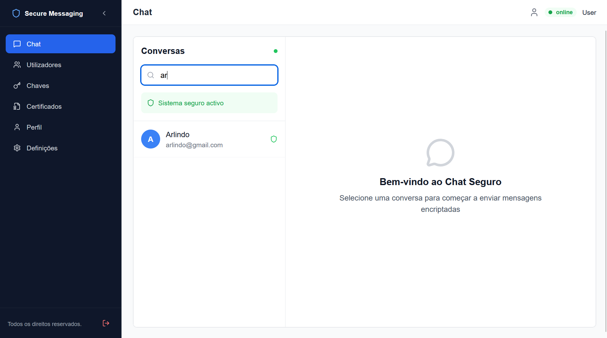

# 🔐 SecureMessaging Web

<div align="center">


**Frontend moderno para comunicação segura com criptografia de ponta a ponta**

[📖 Documentação](#-documentação) • [🚀 Quick Start](#-quick-start) • [📁 Estrutura](#-estrutura-do-projeto) • [🔧 Configuração](#-configuração)

</div>

---

<div align="center">



*Interface de chat seguro - Login e gerenciamento de conversas criptografadas*

</div>

---

## 📋 Visão Geral

O **SecureMessaging Web** é a interface de usuário para o sistema de mensagens seguras. Fornece uma experiência moderna e intuitiva para:

- ✅ Registro e autenticação segura
- ✅ Envio de mensagens com criptografia de ponta a ponta
- ✅ Gerenciamento de certificados digitais
- ✅ Troca de chaves com Diffie-Hellman
- ✅ Interface responsiva e mobile-first
- ✅ Comunicação em tempo real via WebSocket
- ✅ Upload seguro de arquivos

---

## 🚀 Features Principais

### 🔐 Autenticação
- Registro com validação de email
- Login com JWT
- Logout seguro
- Recuperação de senha

### 💬 Mensagens
- Chat em tempo real via WebSocket
- Criptografia RSA/AES de ponta a ponta
- Histórico de conversas
- Busca em mensagens
- Notificações em tempo real

### 📜 Certificados
- Upload de certificados digitais
- Geração de CSR (Certificate Signing Request)
- Visualização de dados do certificado
- Validação de certificados
- Gerenciamento de múltiplos certificados

### 🔑 Segurança
- Armazenamento seguro de chaves
- Troca de chaves com Diffie-Hellman
- Assinatura digital de mensagens
- Proteção contra CSRF

### 👥 Gerenciamento de Usuários
- Perfil do usuário
- Configurações de privacidade
- Gerenciamento de contatos
- Lista de usuários bloqueados

---

## 🛠️ Stack Tecnológico

### Frontend Framework
- **React 18+** — Library UI
- **Vite 5+** — Build tool rápido
- **React Router v6** — Roteamento
- **Context API** — Gerenciamento de estado

### UI & Styling
- **TailwindCSS 3+** — Utility-first CSS
- **Heroicons** — Ícones de qualidade
- **Framer Motion** — Animações suaves (opcional)

### HTTP & Comunicação
- **Axios** — Requisições HTTP
- **WebSocket API** — Comunicação em tempo real

### Criptografia
- **TweetNaCl.js** — Criptografia de ponta a ponta
- **crypto-js** — Operações criptográficas
- **libsodium.js** — Primitivas criptográficas (opcional)

### Desenvolvimento
- **ESLint** — Linting
- **Prettier** — Code formatting
- **Jest** — Testes unitários (opcional)
- **React Testing Library** — Testes de componentes

---

## 📦 Requisitos

- **Node.js 18+** ou **npm 9+**
- **Git**
- **Backend API** rodando em `https://localhost:8443`

---

## 🚀 Quick Start

### 1️⃣ Clone o repositório

```bash
git clone https://github.com/seu-usuario/secure-messaging-web.git
cd secure-messaging-web
```

### 2️⃣ Instale as dependências

```bash
npm install
```

### 3️⃣ Configure as variáveis de ambiente

Crie um arquivo `.env` na raiz do projeto:

```env
VITE_API_URL=https://localhost:8443/api
VITE_WS_URL=wss://localhost:8443/ws
VITE_APP_NAME=SecureMessaging
```

### 4️⃣ Inicie o servidor de desenvolvimento

```bash
npm run dev
```

Abra o navegador em: **http://localhost:5173**

---

## 📁 Estrutura do Projeto

```
src/
├── api/                          # Serviços de API
│   ├── authService.js            # Autenticação
│   ├── messageService.js         # Gerenciamento de mensagens
│   ├── certificateService.js     # Certificados digitais
│   ├── cryptoService.js          # Criptografia
│   ├── keyManagementService.js   # Gerenciamento de chaves
│   └── index.js                  # Exportação centralizada
│
├── components/
│   ├── chat/
│   │   └── Chat.jsx              # Componente principal de chat
│   ├── forms/
│   │   ├── LoginForm.jsx         # Formulário de login
│   │   ├── RegisterForm.jsx      # Formulário de registro
│   │   └── MessageForm.jsx       # Formulário de mensagens
│   ├── layout/
│   │   └── AppLayout.jsx         # Layout principal
│   ├── ui/
│   │   ├── Button.jsx            # Componente botão reutilizável
│   │   ├── Card.jsx              # Componente card
│   │   ├── Modal.jsx             # Componente modal
│   │   └── Tooltip.jsx           # Componente tooltip
│   └── ...
│
├── contexts/
│   └── AuthContext.jsx           # Contexto de autenticação
│
├── hooks/
│   └── useWebSocket.js           # Hook para WebSocket
│
├── pages/
│   ├── LoginPage.jsx             # Página de login
│   ├── RegisterPage.jsx          # Página de registro
│   ├── ChatPage.jsx              # Página principal de chat
│   ├── CertificatesPage.jsx      # Gerenciamento de certificados
│   ├── KeysPage.jsx              # Gerenciamento de chaves
│   ├── ProfilePage.jsx           # Perfil do usuário
│   └── SettingsPage.jsx          # Configurações
│
├── routes/
│   └── AppRoutes.jsx             # Definição de rotas
│
├── utils/
│   └── CryptoUtils.js            # Utilitários de criptografia
│
├── App.jsx                       # Componente raiz
├── main.jsx                      # Ponto de entrada
└── index.css                     # Estilos globais
```

---

## 🔧 Configuração

### Variáveis de Ambiente

```env
# API Backend
VITE_API_URL=https://localhost:8443/api
VITE_WS_URL=wss://localhost:8443/ws

# Aplicação
VITE_APP_NAME=SecureMessaging
VITE_APP_VERSION=1.0.0

# Modo debug
VITE_DEBUG=false
```

### Customização de Estilos

Edite `tailwind.config.js` para personalizar cores e temas:

```javascript
export default {
  theme: {
    extend: {
      colors: {
        primary: '#3B82F6',
        secondary: '#10B981',
      },
    },
  },
}
```

---

## 📡 Integração com API

### Autenticação

```javascript
import { authService } from './api/authService.js';

// Login
const response = await authService.login(email, password);
localStorage.setItem('token', response.token);

// Logout
await authService.logout();
localStorage.removeItem('token');
```

### Enviar Mensagem Criptografada

```javascript
import { messageService } from './api/messageService.js';
import { cryptoService } from './api/cryptoService.js';

// Criptografar e enviar
const encrypted = await cryptoService.encrypt(content, publicKey);
await messageService.sendMessage({
  recipientId: userId,
  content: encrypted,
});
```

### WebSocket em Tempo Real

```javascript
const { connect, send, subscribe } = useWebSocket();

// Conectar ao WebSocket
connect('wss://localhost:8443/ws/messages');

// Inscrever em mensagens
subscribe('message', (msg) => {
  console.log('Nova mensagem:', msg);
});

// Enviar mensagem
send({ type: 'MESSAGE', content: 'Olá!' });
```

---

## 🎨 Componentes Principais

### Chat.jsx
Componente principal que gerencia:
- Conexão WebSocket
- Listagem de mensagens
- Envio de mensagens
- Indicadores de digitação

### MessageForm.jsx
Formulário para envio de mensagens com:
- Validação de entrada
- Criptografia automática
- Upload de arquivos
- Emoji picker (opcional)

### CertificateCard.jsx
Exibição de certificados digitais com:
- Dados do certificado
- Data de validade
- Thumbprint
- Ações (deletar, exportar, etc)

---

## 🧪 Testes

```bash
# Executar testes
npm run test

# Testes com coverage
npm run test:coverage

# Watch mode
npm run test:watch
```

---

## 🏗️ Build para Produção

```bash
# Build otimizado
npm run build

# Preview do build
npm run preview
```

Arquivos gerados em `dist/`:
- HTML minificado
- CSS otimizado
- JavaScript bundled e minificado

---

## 🐳 Docker

### Dockerfile

```dockerfile
FROM node:18-alpine as build
WORKDIR /app
COPY package*.json ./
RUN npm ci
COPY . .
RUN npm run build

FROM nginx:alpine
COPY --from=build /app/dist /usr/share/nginx/html
COPY nginx.conf /etc/nginx/conf.d/default.conf
EXPOSE 80
CMD ["nginx", "-g", "daemon off;"]
```

### Executar

```bash
docker build -t secure-messaging-web:latest .
docker run -d -p 80:80 secure-messaging-web:latest
```

---

## 🔐 Segurança

- ✅ Armazenamento seguro de tokens (sessionStorage)
- ✅ Criptografia de dados sensíveis
- ✅ Proteção contra XSS
- ✅ Validação de entrada
- ✅ HTTPS/TLS em produção
- ✅ CORS configurado corretamente

---

## 🐛 Troubleshooting

### Erro: `Cannot find module`
```bash
npm install
npm run dev
```

### Erro: Falha na conexão com API
- Verifique se a API backend está rodando
- Confirme a URL em `.env`
- Verifique CORS no backend

### Erro: WebSocket bloqueado
- Use `wss://` (WebSocket Secure) em produção
- Confirme firewall rules
- Verifique logs do navegador (F12)

---

## 📊 Performance

- Lazy loading de rotas
- Code splitting automático com Vite
- Minificação de assets
- Otimização de imagens
- Caching de componentes

---

## 📝 Roadmap

- [ ] Dark mode
- [ ] Suporte a voz/vídeo
- [ ] Compartilhamento de tela
- [ ] Backup automático
- [ ] PWA (Progressive Web App)
- [ ] Internacionalização (i18n)

---

## 📚 Documentação Adicional

- [Guia de Criptografia](docs/ENCRYPTION.md)
- [API Reference](docs/API.md)
- [Componentes](docs/COMPONENTS.md)
- [Segurança](docs/SECURITY.md)

---

## 🤝 Contribuindo

1. Fork o projeto
2. Crie uma branch (`git checkout -b feature/MinhaFeature`)
3. Commit (`git commit -m 'Add MinhaFeature'`)
4. Push (`git push origin feature/MinhaFeature`)
5. Abra um Pull Request

---

## 📝 Licença

Licenciado sob [MIT License](LICENSE).

---

## 👨‍💻 Autor

**Arlindo Lázaro**
- GitHub: [@arlindolazaro](https://github.com/arlindolazaro)

---

**⭐ Se este projeto foi útil, deixe uma estrela! ⭐**